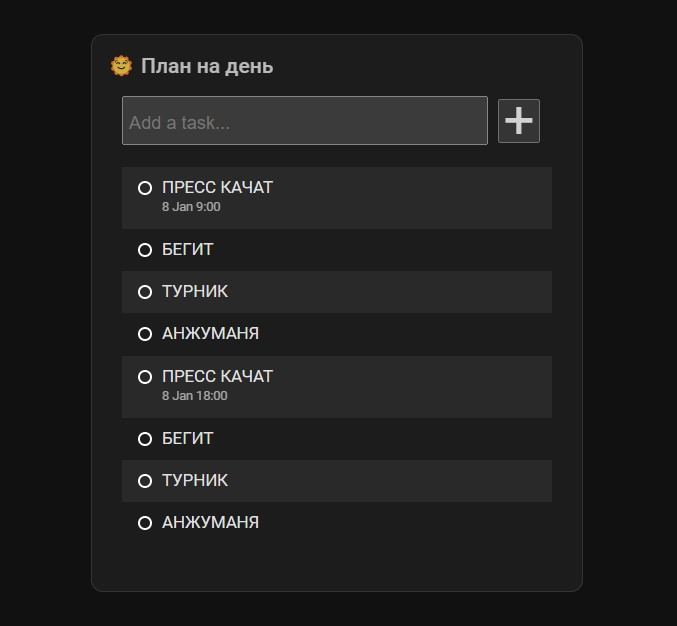

# Todoist widget for Home Assistant

Custom sensor component and Lovelace card that displays tasks from [Todoist](https://todoist.com/).

The widget allows you to close the tasks from your Home Assistant and syncs it back to Todoist.




## 💿 Installation

The component consists of two parts:

1. A sensor, which loads tasks with [Todoist API](https://developer.todoist.com/rest/v2/) every 60 seconds;
2. A card for the Lovelace dashboard, which displays tasks and lets you close them.

We will look at the installation of each of them separately below.

> TODO: test if HACS necessary

#### Todoist

You will need some data from Todoist to continue:

1. Get yourself an [API token here](https://todoist.com/app/settings/integrations/developer).
2. Decide which projects you want to display.
3. Open them in [the web app](https://todoist.com/app) and copy their IDs from the URL.

### Install the sensor

1. Copy the whole [todoist](./custom_components/) directory to the ``/config/`` folder of your Home Assistant installation.

2. Restart Home Assistant.

3. Now you can add your new custom sensor to the corresponding section in the ``configuration.yml`` file.

   ``````yaml
   sensor:
     - platform: todoist
       api_token: <API token>
       projects:
         - project_id: 9034956420
         - project_id: 6747349569
           display_name: "Tasks for today" # Optional, overrides Todoist project's name
   
   # You need this part for passing data from UI to sensor to close tasks
   input_text:
     todoist_closed_task: # Don't change this line
       name: "Todoist closed task" # This one you may change
   ``````

4. Restart Home Assistant again, check the logs for errors, and give it some time to fetch the data.

   - If you are impatient, you can call the ``homeassistant.update_entity`` service on newly created sensors.


### Add the Lovelace card

Having configured the sensor, it's time to setup the widget.

1. Copy the [todoist-card.js](./www) card to the ``/config/www`` directory of your Home Assistant.

2. Go to your Home Assistant dashboard, click "Edit dashboard" at the right top corner and after that in the same top right corner choose "Manage resources".

3. Add new resource ``/local/todoist-card.js`` and click "Create". Go back to your dashboard and **hard-refresh the page**.

4. Click "Add card", choose manual, and use the config below:

   ``````yaml
   type: custom:todoist-card
   entities:
     - sensor.tasks_for_today # Swap to your sensor ID
       max_entries: 10 # Optional, number of tasks to show (default: 10)
   	show_project_name: true # Optional, show or hide the project name (default: true)
   ``````

## 🎨 Styling

If you want to change any styles, font size or layout — the easiest way is to use [card_mod](https://github.com/thomasloven/lovelace-card-mod) component. It allows you to change any CSS classes to whatever you want.

## ❤️ Contributions

Contributions are welcome. Feel free to [open a PR](https://github.com/MrGauz/home-assistant-todoist/pulls) and send it to review. If you are unsure, [open an Issue](https://github.com/MrGauz/home-assistant-todoist/issues) and ask for advice.

## 👮‍♀️ License

- [MIT](./LICENSE.md)